# MCP Server Blueprint

A **hybrid MCP (Model Context Protocol) server** implementation that exposes business logic through multiple interfaces: MCP protocol (STDIO and HTTP streaming) and REST API.

## 🎯 Purpose

This project demonstrates how to build a modern server that serves both AI agents (via MCP) and traditional applications (via REST API) while maintaining a single source of truth for business logic.

## ✨ Key Features

- **Dual Interface Support**: MCP protocol and REST API using the same core business logic
- **Multiple Transport Layers**: STDIO, HTTP streaming (MCP), and standard REST
- **MCP Capabilities**: Tools, Resources, and Prompts
- **Incremental Development**: Phased approach across capabilities and transport layers
- **Modern Python Stack**: UV for package management, FastMCP 2.0, FastAPI

## 🏗️ Architecture

The application follows a **Hexagonal/Ports and Adapters** architecture pattern:

- **Interface Layer**: MCP Server (FastMCP) and REST API (FastAPI)
- **Core Business Logic Layer**: Transport-agnostic, reusable functions

```mermaid
graph TB
    subgraph Interface["Interface Layer"]
        MCP["MCP Server<br/>(FastMCP 2.0)<br/>━━━━━━━━━━━━━<br/>• STDIO transport<br/>• HTTP streaming<br/>• MCP protocol"]
        REST["REST API<br/>(FastAPI)<br/>━━━━━━━━━━━━━<br/>• HTTP endpoints<br/>• JSON responses<br/>• Standard REST"]
    end

    subgraph Core["Core Business Logic Layer"]
        BL["<b>Functions:</b><br/>• Transport-agnostic<br/>• Reusable across interfaces<br/>• Single source of truth<br/>• Pure business logic"]
    end

    MCP --> BL
    REST --> BL

    style Interface fill:#1a1a1a,stroke:#fff,stroke-width:2px,color:#fff
    style Core fill:#0d0d0d,stroke:#fff,stroke-width:2px,color:#fff
    style MCP fill:#2d2d2d,stroke:#fff,stroke-width:2px,color:#fff
    style REST fill:#2d2d2d,stroke:#fff,stroke-width:2px,color:#fff
    style BL fill:#1a1a1a,stroke:#fff,stroke-width:2px,color:#fff
```



For detailed architectural decisions and design patterns, see [Architecture Documentation](docs/ARCHITECTURE.md).

## 🚀 Quick Start

### Prerequisites

- **Python 3.12+**
- **UV** (Python package manager)
- **PostgreSQL 14+** (database)
- **Docker** (optional, for containerized deployment)
- **Cursor IDE** with Claude Code integration (recommended)

### Installation

```bash
# Clone the repository
git clone <repository-url>
cd mcp-server-blueprint

# Install UV (if not already installed)
# macOS (Homebrew)
brew install uv

# Windows (Chocolatey)
choco install uv

# Install dependencies
uv sync

# Set up pre-commit hooks
uv run pre-commit install
```

### Database Setup

```bash
# Install PostgreSQL
# macOS
brew install postgresql@16
brew services start postgresql@16

# Windows
choco install postgresql

# Create database
createdb mcp_server

# Configure environment
cp env.example .env
# Edit .env with your database credentials

# Initialize database and seed data
uv run python scripts/init_db.py
uv run python scripts/seed_tools.py
```

### Running the Server

```bash
# Run MCP server (STDIO mode)
uv run python -m src.mcp_server

# Run tests
uv run pytest

# Run with coverage
uv run pytest --cov=src
```

## 📚 Documentation

| Document | Description |
|----------|-------------|
| [Architecture](docs/ARCHITECTURE.md) | Architectural decisions, design patterns, and development phases |
| [Setup Guide](docs/SETUP.md) | Development environment setup, tools, and configuration |
| [Database Guide](docs/DATABASE.md) | Database schema, setup, migrations, and management |
| [Usage Guide](docs/USAGE.md) | Common usage patterns and examples |
| [Contributing](docs/CONTRIBUTING.md) | Guidelines for contributing to the project |
| [API Documentation](docs/API.md) | MCP tools/resources/prompts and REST endpoint reference |

## 🛠️ Technology Stack

- **Language**: Python 3.12+
- **Package Manager**: [UV](https://github.com/astral-sh/uv) - Fast Python package installer
- **MCP Framework**: [FastMCP 2.0](https://github.com/jlowin/fastmcp) - STDIO and HTTP streaming support
- **REST Framework**: [FastAPI](https://fastapi.tiangolo.com/) - High-performance REST API
- **Database**: [PostgreSQL](https://www.postgresql.org/) with async support (SQLAlchemy + asyncpg)
- **Development Tools**:
  - Cursor IDE with Claude Code integration
  - Pre-commit hooks for code quality
  - Docker for containerization
  - Ruff for linting and formatting
  - Pytest for testing

## 📋 Development Phases

The project is developed in **three major phases**, each with **three sub-steps**:


**Summary:**
- **Phase 1: Tools** - Implement MCP tools across all transport layers
- **Phase 2: Resources** - Add MCP resources across all transport layers  
- **Phase 3: Prompts** - Implement MCP prompts across all transport layers

Each phase follows the same pattern: STDIO → HTTP Streaming → REST API

See [Architecture Documentation](docs/ARCHITECTURE.md) for detailed phase breakdown.

## 🤝 Contributing

We welcome contributions! Please read our [Contributing Guidelines](docs/CONTRIBUTING.md) before submitting PRs.

### Development Workflow

1. Fork the repository
2. Create a feature branch
3. Make your changes
4. Run tests and linters
5. Submit a pull request

## 📝 License

[Add your license here]

## 🔗 Resources

- [MCP Protocol Specification](https://modelcontextprotocol.io/)
- [FastMCP Documentation](https://github.com/jlowin/fastmcp)
- [FastAPI Documentation](https://fastapi.tiangolo.com/)
- [UV Documentation](https://github.com/astral-sh/uv)

## 📧 Contact

[Add your contact information here]

---

**Built with ❤️ using Cursor + Claude Code**
