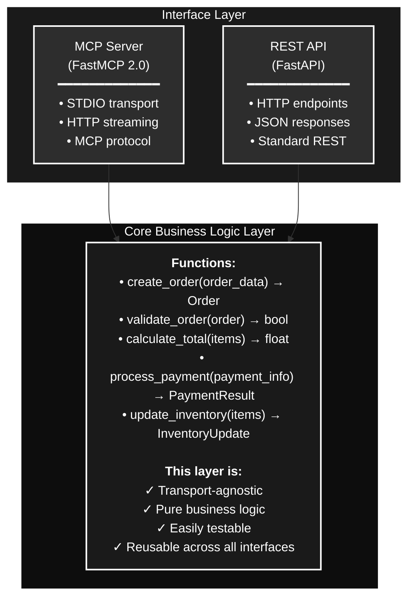

# Hybrid MCP Server Architecture

## Overview

This project implements a **hybrid server architecture** that exposes the same business logic through two different interfaces:
1. **MCP (Model Context Protocol)** - For AI agents and tools
2. **REST API** - For traditional web applications and services

## Why a Hybrid Solution?

In modern application development, we need to support both emerging AI-driven workflows and traditional HTTP-based integrations. Rather than building and maintaining separate systems for each interface, a hybrid approach allows us to:

### 1. **Maintain a Single Source of Truth**
By implementing business logic once and exposing it through multiple interfaces, we ensure consistency across all entry points. The same validation rules, business constraints, and processing logic apply whether the request comes from an AI agent or a web application.

### 2. **Maximize Code Reuse**
Instead of duplicating business rules across different systems, we write them once and reuse them everywhere. This reduces maintenance burden, minimizes bugs, and makes updates simpler.

### 3. **Future-Proof the Architecture**
As new interface requirements emerge (GraphQL, gRPC, WebSockets, etc.), we can easily add new transport layers without modifying the core business logic.

### 4. **Support Multiple Client Types**
- **AI Agents** can use MCP tools to interact with our services in a structured, LLM-friendly way
- **Web Applications** can use familiar REST APIs with standard HTTP methods
- **Mobile Apps** can leverage the same REST endpoints
- **Internal Services** can choose the most appropriate protocol for their needs

## Technology Stack

- **Language**: Python
- **Package Manager**: UV (for fast, reliable dependency management)
- **MCP Framework**: FastMCP 2.0 (supporting STDIO and streamable HTTP)
- **REST Framework**: FastAPI (for high-performance REST endpoints)
- **Architecture Pattern**: Hexagonal/Ports and Adapters

## Development Phases

The application will be developed in a systematic, incremental approach across **three major phases**, each covering a core MCP capability. Each phase consists of **three sub-steps** that progressively add transport layers:

### Phase 1: Tools
MCP tools allow AI agents to execute functions and operations.

1. **Sub-step 1.1**: Implement tools via **STDIO** (FastMCP)
   - Tools accessible through standard input/output
   - Core business logic functions created and tested
   - MCP tool schemas defined

2. **Sub-step 1.2**: Add tools via **Streamable HTTP** (FastMCP)
   - Same tools now accessible via HTTP streaming
   - MCP HTTP transport layer implemented
   - Streaming responses supported

3. **Sub-step 1.3**: Expose tools via **REST API** (FastAPI)
   - HTTP REST endpoints created
   - Same core business logic reused
   - Standard REST conventions applied

### Phase 2: Resources
MCP resources provide AI agents access to data and content.

1. **Sub-step 2.1**: Implement resources via **STDIO** (FastMCP)
   - Resources accessible through standard input/output
   - Core data access logic created
   - MCP resource schemas defined

2. **Sub-step 2.2**: Add resources via **Streamable HTTP** (FastMCP)
   - Same resources available via HTTP streaming
   - Efficient data streaming implemented

3. **Sub-step 2.3**: Expose resources via **REST API** (FastAPI)
   - HTTP REST endpoints for resource access
   - Same core data access logic reused
   - Standard REST resource patterns applied

### Phase 3: Prompts
MCP prompts provide reusable prompt templates for AI agents.

1. **Sub-step 3.1**: Implement prompts via **STDIO** (FastMCP)
   - Prompts accessible through standard input/output
   - Core prompt management logic created
   - MCP prompt schemas defined

2. **Sub-step 3.2**: Add prompts via **Streamable HTTP** (FastMCP)
   - Same prompts available via HTTP streaming
   - Dynamic prompt composition supported

3. **Sub-step 3.3**: Expose prompts via **REST API** (FastAPI)
   - HTTP REST endpoints for prompt management
   - Same core prompt logic reused
   - Standard REST conventions for prompts

### Development Strategy Benefits

- **Incremental Complexity**: Start simple (STDIO), add layers progressively
- **Continuous Validation**: Each sub-step can be tested before moving forward
- **Reusable Foundation**: Core business logic built in Phase 1 is reused in Phases 2 and 3
- **Risk Mitigation**: Issues are caught early in each phase before adding new capabilities
- **Clear Milestones**: Each sub-step represents a deliverable, testable unit of work

## Example: Order Creation Flow (Educational)

**Note**: The following example uses order creation for educational purposes to illustrate the hybrid architecture concept. The actual application will implement tools, resources, and prompts as described in the Development Phases above.

To illustrate how the hybrid architecture works in practice, consider the order creation workflow:

### Scenario 1: AI Agent (MCP)
1. An AI agent needs to process an order for a user
2. The agent makes an MCP `tools/call` request to the `create_order` tool on the MCP server
3. The MCP server receives the request, validates the MCP-specific format
4. The server translates the request and calls the shared `create_order()` function in the core business logic layer
5. The business logic validates the order, processes it, and returns a result
6. The MCP server wraps the result in an MCP response format and returns it to the agent

### Scenario 2: Traditional Application (REST)
1. A user in a web application fills out an order form and clicks "Submit"
2. The frontend makes a `POST /orders` request to the REST API
3. The REST API receives the HTTP request and validates the request body
4. The API translates the request and calls the **same** `create_order()` function in the core business logic layer
5. The business logic validates the order, processes it, and returns a result
6. The REST API wraps the result in a JSON response with appropriate HTTP status codes

### Key Insight
In both scenarios, **the exact same business logic executes**:
- Same validation rules (e.g., required fields, valid quantities, price checks)
- Same order processing workflow
- Same database interactions
- Same error handling
- Same side effects (notifications, inventory updates, etc.)

The **only difference** is the transport layer and data serialization format. This guarantees consistency and makes the system easier to test, maintain, and extend.

## Architecture Diagram

## Benefits Realized

1. **Consistency**: Both AI agents and web apps get identical behavior
2. **Testability**: Test business logic once, gain confidence everywhere
3. **Maintainability**: Update logic in one place, all interfaces benefit
4. **Flexibility**: Add new interfaces without touching business logic
5. **Developer Experience**: Clear separation of concerns makes the codebase easier to understand
6. **Performance**: Each interface can be optimized independently while sharing the heavy lifting

## Next Steps

This document will be expanded to include:
- Detailed implementation guidelines
- Code structure and organization
- Error handling strategies
- Authentication and authorization approaches
- Testing strategies
- Deployment considerations

